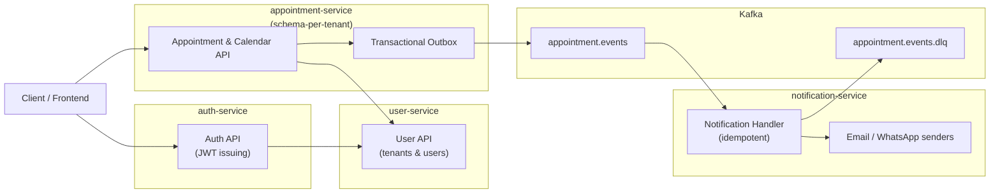

## Theratime Microservices Project

Theratime is a multi-module microservices-based platform for managing authentication, users, and therapy appointments, with tenant-aware notifications (email/WhatsApp). It is built with Java 17, Spring Boot, PostgreSQL, Kafka, Redis, Flyway, and Docker.

---

### High-level architecture



---

### What this project demonstrates about me as an engineer

- **Pragmatic distributed systems design**:  
  Schema-per-tenant multi-tenancy; transactional outbox; Kafka-based events; idempotent notifications with retries/backoff and DLQ.  
  See `docs/TENANT_MODEL.md`, `docs/EVENTS.md`, `docs/NOTIFICATION_SERVICE.md`.

- **Production-oriented reliability thinking**:  
  Resilience4j-based retries/circuit breakers for cross-service calls, transactional integrity and concurrency control on booking, and explicit tradeoffs around SAGA vs outbox.  
  See `design/multi_tenant_production/README.md` and `docs/PRODUCTION_OPERATIONS.md`.

- **Observability & operations awareness**:  
  Actuator, Micrometer + Prometheus, Zipkin tracing hooks, structured logging with correlation/tenant/user IDs, and Testcontainers-based integration tests.

- **API-first, well-structured microservices**:  
  OpenAPI-driven delegates, clear layering (controller/delegate → service → repository), and test coverage across unit, slice, and integration levels.

---

### Highlights for reviewers (start here)

- **Multi-tenancy design**: `docs/TENANT_MODEL.md`  
  How schema-per-tenant is implemented and how tenant routing works at runtime.

- **Eventing & reliability**: `docs/EVENTS.md`, `docs/NOTIFICATION_SERVICE.md`  
  Transactional outbox, Kafka topic design, idempotent notification consumer, retries/backoff, and DLQ behavior.

- **Production blueprint**: `design/multi_tenant_production/README.md` and `docs/PRODUCTION_OPERATIONS.md`  
  How the MVP evolves into a production-ready system; SAGA tradeoffs; operational runbooks.

- **Integration & resilience tests**:  
  - Appointment → outbox → Kafka integration:  
    `appointment-service/src/test/java/com/theratime/appointment/integration/AppointmentBookingIntegrationTest.java`  
  - Notification retries + DLQ integration:  
    `notification-service/src/test/java/com/theratime/notification/integration/NotificationFlowIntegrationTest.java`

---

### Modules

1. **Auth Service** (`auth-service`)  
   Issues and validates JWT access/refresh tokens; manages credentials.

2. **User Service** (`user-service`)  
   Manages tenants and users; holds tenant registry.

3. **Appointment Service** (`appointment-service`)  
   Handles booking, rescheduling, cancellation, calendar blocks, and publishes tenant-aware events using a transactional outbox.

4. **Notification Service** (`notification-service`)  
   Consumes `appointment.events`, resolves per-tenant/per-therapist notification config, and sends idempotent email/WhatsApp notifications with retries and DLQ.

---

### API tour (end-to-end example)

#### 1. Register and authenticate a user (Auth & User)

- **Register user** (simplified, via auth or user service depending on flow):
  - `POST /api/users` (user-service)

- **Login to get JWT access/refresh tokens**:
  - `POST /api/auth/login` (auth-service)
  - Response includes `accessToken` and `refreshToken`.

Example (login):

```bash
curl -X POST "http://localhost:8083/api/auth/login" \
  -H "Content-Type: application/json" \
  -d '{
    "email": "therapist@example.com",
    "password": "password123"
  }'
```

Use the returned `accessToken` as a `Bearer` token for subsequent calls.

#### 2. Book an appointment (Appointment Service)

- **Endpoint**: `POST /api/appointments` (generated path may be `/appointments/book` depending on OpenAPI)  
- **Auth**: `Authorization: Bearer <accessToken>`  
- **Body** (simplified):

```bash
curl -X POST "http://localhost:8081/api/appointments" \
  -H "Authorization: Bearer $ACCESS_TOKEN" \
  -H "Content-Type: application/json" \
  -d '{
    "userId": 3,
    "therapistId": 2,
    "startTime": "2025-02-01T10:00:00Z",
    "endTime": "2025-02-01T10:45:00Z"
  }'
```

Result:
- Appointment stored in the appropriate tenant schema.
- Outbox row created in the same DB transaction.
- OutboxPublisher later publishes an `appointment.created` event to Kafka.

#### 3. Notifications (Notification Service)

With a notification config row present for the tenant:

- Notification-service consumes `appointment.created` from `appointment.events`.
- It builds a subject/body and sends email and/or WhatsApp, **idempotently**:
  - Processed events are tracked in `processed_events`.
  - Retries/backoff and DLQ are handled via `@RetryableTopic`.

Example of the event payload on Kafka (simplified):

```json
{
  "eventId": "9b5b7ac0-...",
  "eventType": "appointment.created",
  "tenantId": 1,
  "appointmentId": 42,
  "userId": 3,
  "therapistId": 2,
  "startTime": "2025-02-01T10:00:00Z",
  "endTime": "2025-02-01T10:45:00Z",
  "status": "BOOKED",
  "occurredAt": "2025-01-24T12:00:00.123Z"
}
```

For more API details, see the OpenAPI specs:
- `auth-service/src/main/resources/openapi/auth-api.yaml`
- `user-service/src/main/resources/openapi/user-api.yaml`
- `appointment-service/src/main/resources/openapi/appointment-api.yaml`

---

### Deployment (local & production-oriented)

For detailed steps, see **[docs/DEPLOYMENT.md](docs/DEPLOYMENT.md)**. High level:

- **Local (Docker Compose)**:
  - `docker-compose build`
  - `docker-compose up`
  - Brings up Postgres, Kafka/ZooKeeper, Zipkin, and all services.

- **Kubernetes (example manifests)**:
  - See `k8s/*.yaml` for Deployments, Services, ConfigMap, and Ingress.
  - Images are expected as `theratime/<service-name>:latest`.

---

### Security considerations (high level)

- **Authentication**:
  - JWT access/refresh tokens issued by auth-service; validated in appointment-service via `TokenValidatorFilter`.

- **Authorization**:
  - Method and endpoint-level checks (e.g., only therapists can block calendar slots or manage their own appointments).

- **Tenant isolation**:
  - Schema-per-tenant in the appointments DB; tenant resolved from authenticated user and set in `TenantContext`.

- **Transport & secrets**:
  - In production, services should be fronted by TLS-terminating ingress/proxy.
  - DB passwords, JWT secrets, and SMTP credentials should be stored in secrets (env vars, Vault, etc.), not in source.

More operational guidance: `docs/PRODUCTION_OPERATIONS.md`.

---

### Testing

- **Unit and slice tests** for services, mappers, filters, and exception handlers.
- **Integration tests with Testcontainers**:
  - User repository integration (user-service).
  - Booking/outbox/Kafka integration (appointment-service).
  - Notification retries and DLQ integration (notification-service).

Run all tests:

```bash
mvn test
```

Run integration profile (if desired):

```bash
mvn verify -Pintegration
```

---

### License

This project is licensed under the MIT License. See the `LICENSE` file for details.
